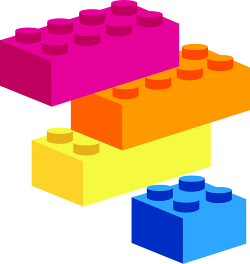

# DeFi Playground

A playground to interact with DeFi protocols deployed on Ethereum.

<p align="center">
	
</p>

## About

This repository is intended to kick-start new DeFi protocol deployments. It should help to setup a local development environment with all Ethereum contracts deployed without the need to go through each project's deploy scripts. Here are the cool features of this project:

- No need to deploy smart contracts yourself, just start the local blockchain and have all your favourite DeFi protocols available.
- A standard interface to get the contract's ABIs to use in your own projects.
- Quickly deploy new apps and smart contracts.

### Built with

- [nodejs](https://nodejs.org/en/)
- [ganache-cli](https://github.com/trufflesuite/ganache-cli)

## Getting started

### Prerequisites

Make sure you have [ganache-cli] installed.

```bash
npm install -g ganache-cli
```

### Installation

Clone the repository.

```bash
git clone git@github.com:nud3l/defi-playground.git
```

## Usage

From the root folder of the repository, run the testchain.


## Contributing

Contributions are what make the open source community such an amazing place to be learn, inspire, and create. Any contributions you make are greatly appreciated.

1. Fork the Project
2. Create your Feature Branch (git checkout -b feature/AmazingFeature)
3. Commit your Changes (git commit -m 'Add some AmazingFeature')
4. Push to the Branch (git push origin feature/AmazingFeature)
5. Open a Pull Request

## License

Distributed under the MIT License. See `LICENSE` for more information.

## Contact

Dominik Harz  - [@dominik0](https://twitter.com/dominik0_)
